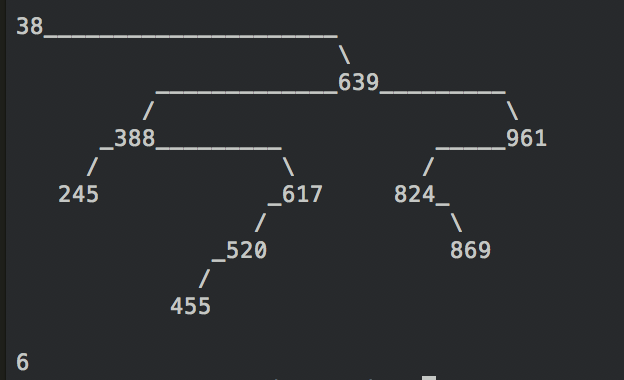

## Algorithm practice
Practicing sorting algorithms, dealing with linked lists, hash tables, stacks, queues, binary search trees, etc.

## Github Link:
[Algorithm GitHub](https://github.com/eddieatkinson/algorithms)

## Technologies used:
**Languages:**
* Python

## Code snippets:
Bubble sort:
``` python
def bubble_sort(a):
  swapped = True
  while swapped:
    swapped = False
    for i in range(len(a) - 1):
      if (a[i] > a[i + 1]):
        # temp = a[i]
        # a[i] = a[i + 1]
        # a[i + 1] = temp
        a[i], a[i + 1] = a[i + 1], a[i]
        swapped = True
  return a
```
Insertion sort:
``` python
def insertion_sort(array):
  for i in range(len(array)):
    temp = array[i]
    j = i
    while j > 0 and array[j - 1] > temp:
      array[j] = array[j - 1]
      j -= 1
      
    array[j] = temp
  print array
```
Hash tables:
``` python
class LinkedListNode:
    def __init__(self, key, value):
      self.key = key
        self.value = value
        self.right = None
        self.left = None

class LinkedList:
    def __init__(self):
        self.start = None
        self.end = None

    def append(self, key, value):
        new_node = LinkedListNode(key, value)

        if self.start is None:
            self.start = new_node
            self.end = new_node
        else:
            self.end.right = new_node
            new_node.left = self.end
            self.end = new_node

class MyHashTable:
  def __init__(self):
    self.my_array = [None] * 26

  def put(self, key, value):
    index = self.my_hash_function(key)
    if self.my_array[index] == None:
      self.my_array[index] = LinkedList()

    self.my_array[index].append(key, value)

  def get(self, key):
    index = self.my_hash_function(key)
    if self.my_array[index] == None:
      return None

    linked_list = self.my_array[index]

    current_node = linked_list.start

    while current_node != None:
      if current_node.key == key:
        return current_node
      current_node = current_node.right

  def my_hash_function(self, inputValue):
    alphabet = 'abcdefghijklmnopqrstuvwxyz'
    first_letter = inputValue[0]
    return alphabet.index(first_letter)

```
Binary search trees:
``` python
class MyBinaryTreeNode(Node):
  def __init__(self, value):
    self.value = value
    self.parent = None
    self.left = None
    self.right = None

  def add(self, new_node):
    if new_node.value >= self.value:
      if self.right is None:
        self.right = new_node
        new_node.parent = self
      else:
        self.right.add(new_node)
    else:
      if self.left is None:
        self.left = new_node
        new_node.parent = self
      else:
        self.left.add(new_node)

  def exists(self, value_to_search_for):
    if self.value == value_to_search_for:
      return True
    elif self.value < value_to_search_for:
      if self.right is not None:
        return self.right.exists(value_to_search_for)
      else:
        return False
    else:
      if self.left is not None:
        return self.left.exists(value_to_search_for)
      else:
        return False

  def height(self):
    if self.left is None and self.right is None:
      return 1

    left_subtree_height = 0
    right_subtree_height = 0

    if self.left is not None:
      left_subtree_height = self.left.height()

    if self.right is not None:
      right_subtree_height = self.right.height()

    if left_subtree_height > right_subtree_height:
      return left_subtree_height + 1
    else:
      return right_subtree_height + 1

  def print_in_order(self):
    if self.left is not None:
      self.left.print_in_order()
    print self.value

    if self.right is not None:
      self.right.print_in_order()

  def print_preorder(self):
        print self.value

        if self.left is not None:
            self.left.print_in_order()

        if self.right is not None:
            self.right.print_in_order()

    def print_post_order(self):
        if self.left is not None:
            self.left.print_in_order()

        if self.right is not None:
            self.right.print_in_order()

        print self.value

class BST:
  def __init__(self):
    self.root = None

  def add(self, value):
    new_node = MyBinaryTreeNode(value)

    if self.root is None:
      self.root = new_node
    else:
      self.root.add(new_node)

  def exists(self, value):
    if self.root is None:
      return False
    else:
      return self.root.exists(value)

  def height(self):
    if self.root is not None:
      return self.root.height()
    return 0

  def print_in_order(self):
    if self.root is not None:
      self.root.print_in_order()
```

## Screenshots:
Binary tree:


